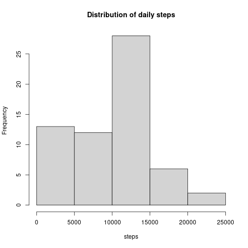
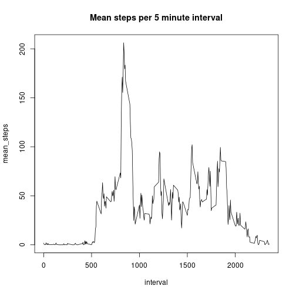
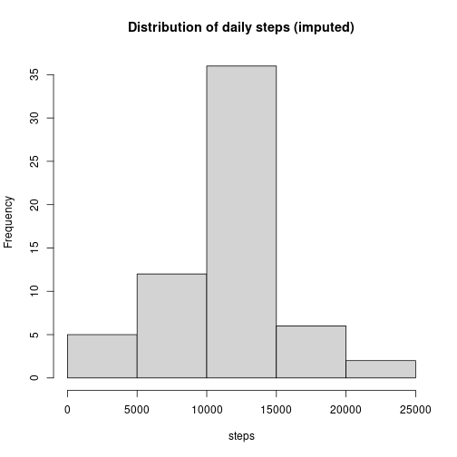
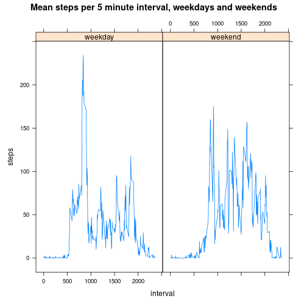

## Loading and preprocessing the data

This corresponds to requirement (1) of the assignment. The source data is in the 
`activity.zip` file; to get started, let's unzip and read in the 
resulting csv, then view the head of the frame to see what we're dealing with.


```r
unzip('activity.zip')
activity <- read.csv('activity.csv')
head(activity)
```

```
##   steps       date interval
## 1    NA 2012-10-01        0
## 2    NA 2012-10-01        5
## 3    NA 2012-10-01       10
## 4    NA 2012-10-01       15
## 5    NA 2012-10-01       20
## 6    NA 2012-10-01       25
```

To get started, the activity frame needs the date cast to a true date. Later on, there 
will be a column created for imputed steps and another for weekday vs weekend, but this 
is enough for now.


```r
activity$date <- as.POSIXct(activity$date)
```

## What is mean total number of steps taken per day?

This corresponds to requirements (2) and (3) of the assignment, looking at daily patterns. 
We first need to sum by day, ignoring NA values for steps.


```r
library(dplyr)
daily_activity <- activity %>% group_by(date) %>% summarise(steps = sum(steps, na.rm = TRUE))
```

Now we can get a sense of the distribution of steps:


```r
hist(daily_activity$steps, main = 'Distribution of daily steps', xlab = 'steps')
```



This shows a day typically between 10k and 15k steps, which is quite active but plausible. 

Mean and median come simply from the summary:


```r
summary(daily_activity$steps)
```

```
##    Min. 1st Qu.  Median    Mean 3rd Qu.    Max. 
##       0    6778   10395    9354   12811   21194
```

## What is the average daily activity pattern?

This corresponds to requirements (4) and (5) of the assignment. For this, we need 
to aggregate activity by interval to get the mean steps, ignoring NAs.


```r
interval_activity <- activity %>% 
  group_by(interval) %>% 
  summarise(mean_steps = mean(steps, na.rm = TRUE))
```

Let's visualize this over the course of the day:


```r
with(interval_activity, 
     plot(interval, mean_steps, type = 'l', main = 'Mean steps per 5 minute interval')
)
```



This shows a pronounced maximum:


```r
interval_activity %>% arrange(desc(mean_steps)) %>% head(n=1)
```

```
## # A tibble: 1 x 2
##   interval mean_steps
##      <int>      <dbl>
## 1      835       206.
```

## Imputing missing values

This corresponds to requirements (6) and (7) of the assignment. A reasonable first pass at 
imputing missing steps might be to look at the mean steps per interval calculated in the last 
section. We could simply join in the calculated data frame, and coalesce. If we cared about 
the imputed steps being an integer we could take the floor, or round, the mean steps, but 
this seems superfluous to me. I will simply coalesce as is, with the imputed_steps column being 
a double. We'll look at a summary afterward to verify this worked, first 
outputting the number of NAs as required.


```r
number_nas <- sum(is.na(activity$steps))
print(paste('The number of NA step measurements is:', number_nas))
```

```
## [1] "The number of NA step measurements is: 2304"
```

```r
imputed_activity <- inner_join(activity, interval_activity, by = 'interval') %>% 
  mutate(steps = coalesce(steps, mean_steps)) %>% 
  select(steps, date, interval)

summary(imputed_activity)
```

```
##      steps             date                        interval     
##  Min.   :  0.00   Min.   :2012-10-01 00:00:00   Min.   :   0.0  
##  1st Qu.:  0.00   1st Qu.:2012-10-16 00:00:00   1st Qu.: 588.8  
##  Median :  0.00   Median :2012-10-31 00:00:00   Median :1177.5  
##  Mean   : 37.38   Mean   :2012-10-31 00:25:34   Mean   :1177.5  
##  3rd Qu.: 27.00   3rd Qu.:2012-11-15 00:00:00   3rd Qu.:1766.2  
##  Max.   :806.00   Max.   :2012-11-30 00:00:00   Max.   :2355.0
```
Now we can produce a version of the first histogram, using the imputed steps:


```r
imputed_daily_activity <- imputed_activity %>% 
  group_by(date) %>% 
  summarise(steps = sum(steps))
hist(imputed_daily_activity$steps, 
     main = 'Distribution of daily steps (imputed)',
     xlab = 'steps')
```



We can get the mean and median simply from the summary:


```r
summary(imputed_daily_activity$steps)
```

```
##    Min. 1st Qu.  Median    Mean 3rd Qu.    Max. 
##      41    9819   10766   10766   12811   21194
```

## Are there differences in activity patterns between weekdays and weekends?

This corresponds to requirement (6) of the assignment. We will be going back to the original 
activity frame here; we need to calculate from the date a weekday vs weekend factor variable, 
then find the mean steps grouped by the weekday_vs_weekend and interval variables, ignoring NAs.


```r
activity_weekday_vs_weekend <- activity %>% 
  mutate(day_of_week = weekdays(date),
         weekday_vs_weekend = as.factor(if_else(day_of_week %in% c("Saturday", "Sunday"), 
                                                  "weekend", 
                                                  "weekday"))
         ) %>% 
  group_by(weekday_vs_weekend, interval) %>% 
  summarise(mean_steps = mean(steps, na.rm = TRUE))
```

Now we can produce the required facet plot:


```r
library(lattice)

p <- xyplot(mean_steps ~ interval | weekday_vs_weekend, 
            data = activity_weekday_vs_weekend,
            type = 'l',
            main = 'Mean steps per 5 minute interval, weekdays and weekends',
            ylab = 'steps')

print(p)
```


